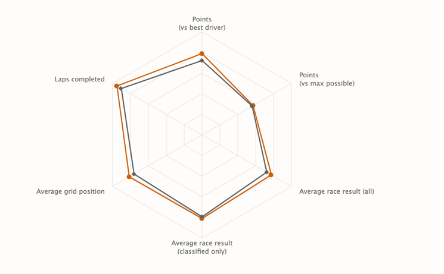
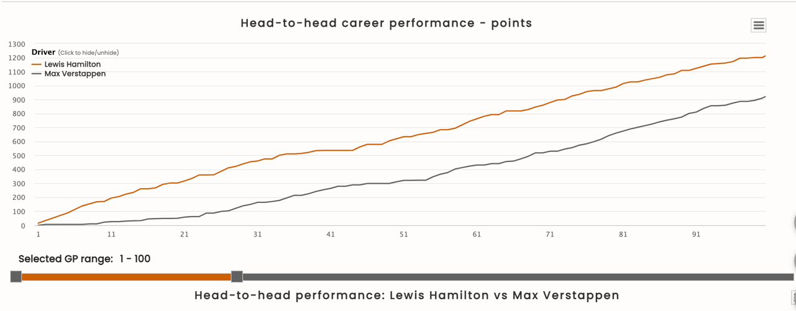
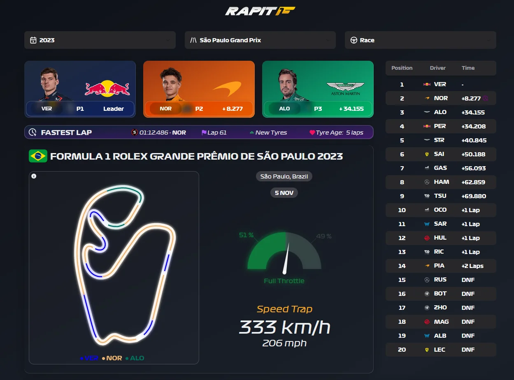
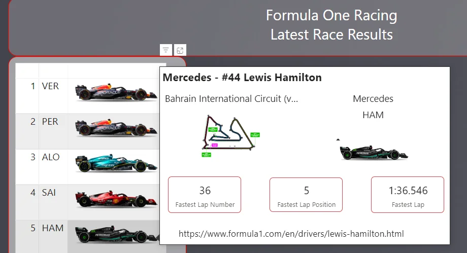

# README

Mælaborðið snýr að samanburði á milli Lewis Hamilton og Max verstappen í gegnum árin. Fyrst mun mælaborðið sýna stigafjöldasögu kappakstursmannana á árunum 2015 - 2024. Síðan er ætlunin að hafa könuglóa rit fyrir helstu afrekstölur kappakstursmannana og flokkum þær tölur eftir keppnistímabilum. Hér ma sjá dæmi um hvernig sum ritin gætu litið út:

Hér fyrir neðan má sjá hugmyndir af mælaborðum sem við munum útfæra þegar lengra er komið:

1. **Spider chart hugmynd til að sjá samanburð á afrekstölum keppana**

2. **Línurit til þess að sjá stig yfir tíma**


Við munum síðan reyna að bæta við myndum af keppendum, bílnum sem þeir keppa á og myndum af braut.
Læt fylgja með smá hugmynd sem við höfum verið að skoða:





Höfum database-ið `f1db.db`. Höfum prófað að gera app með gröfum, alls ekki fullkomið hægt að sjá gróflega hvernig gögnin lýta út og hvernig þau eru upp sett.

## Keyrsla

Keyrðu eftirfarandi skipun til þess að vera í réttu umhverfi:

```bash
pip install -r requirements.txt
```
síðan getur keyrt annað hvort `appdb.py` eða `appgogn.db` með eftirfarandi skipun:

```bash
shiny run appdb.py
```
Ef þú ert með windows tölvu gæti verið að þú þurfir að keyra þessa skipun til þess að keyra app-ið:
```bash
python -m shiny run --reload appdb.py
```

## `appgogn.py`
Þetta er app sem ég gerði til þess að geta séð gögnin í gagnagrunninum betur. Getið keyrt og séð uppsetningu á gögnunum

## `appdb.py`
Þetta app er bara ég að fikt og búa til gröf.  getið skoðað þetta en veit að dálkurinn fyrir 'liðframmistaða' virkar ekki alveg.
Þetta er semsagt 3 dálkar
- **Ökumannsframmistaða** 
Hægt að velja ökumann og sjá stig yfir keppnir
- **Liðframmistaða**
Hægt að velja lið og sjá frammistöðu
*ATH. einhvað bilað*
- **Brautarframmistaða**
Hægt að velja braut og sjá frammistöðu keppanda
*Frekar óskýrt*

Eins og ég sagði þá er þetta bara við að fikta með gögnin. Þið getið prófað að keyra og koma með hugmyndir af endurbótum.